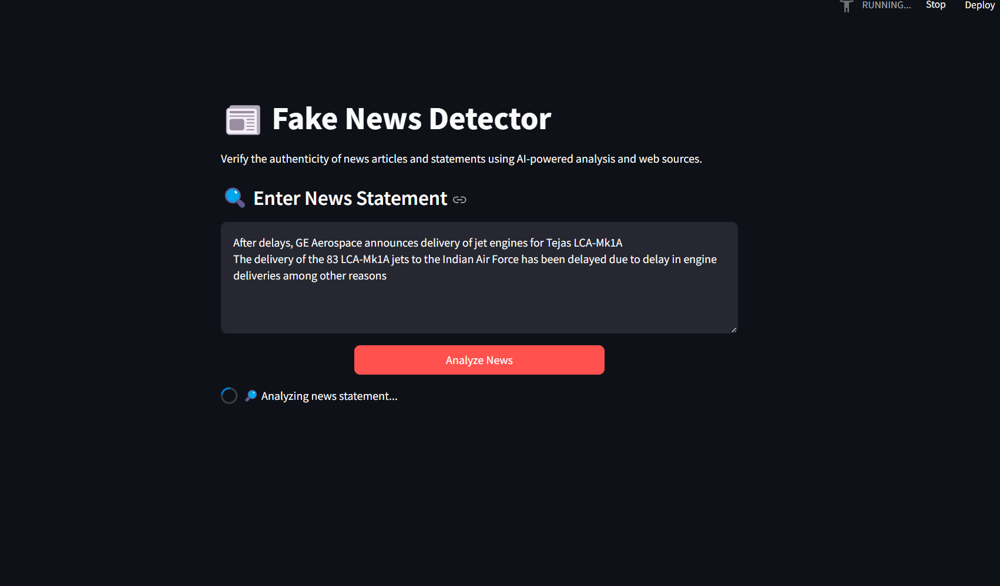
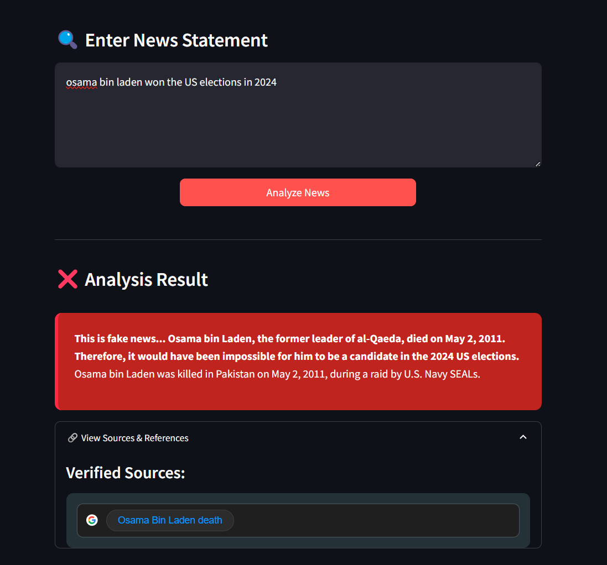

# 📰 Fake News Detector

## Overview
The **Fake News Detector** is an AI-powered web application designed to help users verify the authenticity of news articles and statements. By leveraging **Google’s Gemini AI**, the app analyzes news content, cross-references it with credible sources, and provides a verdict on its accuracy.

## ✨ Features
- ✅ **AI-Powered Analysis** – Uses Google’s **Gemini-2.0 Flash** model to evaluate the credibility of news statements.
- 🔍 **Web Search Integration** – Cross-checks information with reliable sources for fact-checking.
- 🎨 **User-Friendly Interface** – Interactive and responsive **Streamlit** web app.
- 🟩 **Clear Results Display** – True news in **green**, fake news in **red** for instant recognition.
- 🔐 **Secure API Handling** – Uses `.env` file to store API keys securely.

## 📌 How It Works
1. **Enter News Statement** – Users paste the news they want to verify.
2. **AI Processing** – The model analyzes the statement and retrieves supporting evidence.
3. **Result Display** – The app presents a color-coded verdict with sources.
4. **References** – Users can view links to verified sources for further validation.

## 🛠 Tech Stack
- **Python** – Core programming language
- **Streamlit** – For interactive web UI
- **Google Gemini API** – AI-powered analysis
- **Google Search API** – Retrieves supporting evidence
- **dotenv** – Manages API keys securely
- **HTML & CSS** – Custom styling for better UI experience

## 🚀 Installation & Setup

### Prerequisites
Make sure you have **Python 3.x** installed.

### Clone the Repository
```bash
git clone https://github.com/yourusername/Fake-News-Detector.git
cd Fake-News-Detector
```

### Install Dependencies
```bash
pip install -r requirements.txt
```

### Set Up API Keys
1. Create a `.env` file in the root directory.
2. Add the following line to store your Google Gemini API key securely:
```bash
GOOGLE_API_KEY=your_google_api_key_here
```

### Run the App
```bash
streamlit run app.py
```

## 📷 Screenshots
## 📷 Screenshots






## 🏆 Impact
- **Combat misinformation** by providing quick AI-driven verification.
- **Empower users** with reliable, fact-checked information.
- **Enhance media literacy** by promoting awareness of fake news trends.

## 🤝 Contributing
Feel free to fork this repository and submit pull requests with improvements!

## 📜 License
This project is licensed under the **MIT License**.

## 📬 Contact
For any queries or suggestions, reach out to **Surakanti Advaith Reddy** at  [LinkedIn](https://www.linkedin.com/in/cadva/) .
